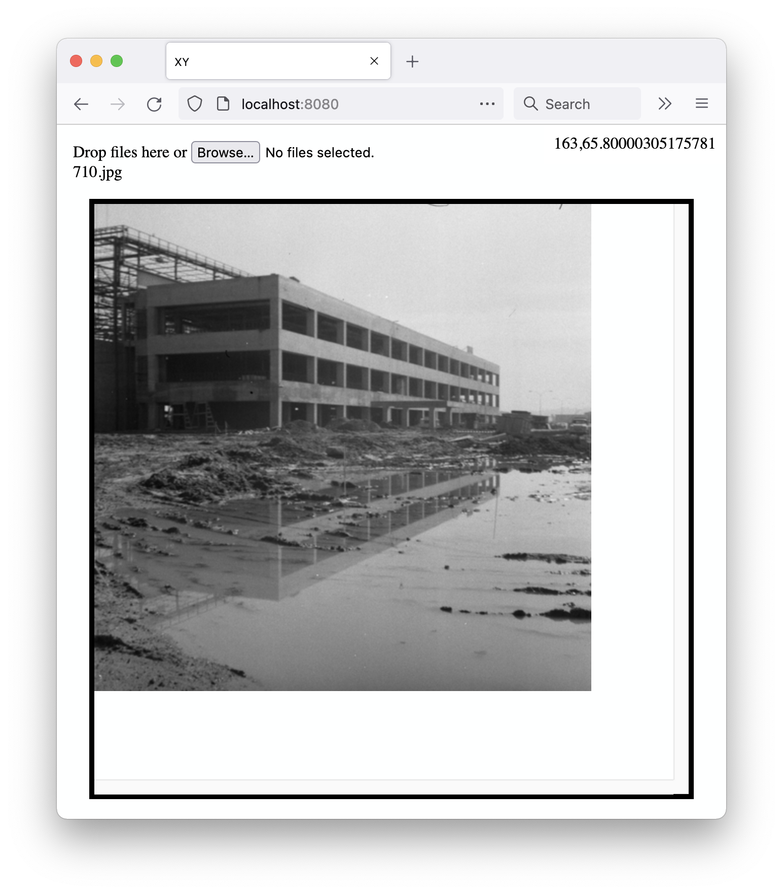

# www-sfomuseum-xy

Simple web application to record the x,y coordinates for points in an image.

## Important

This is a very early-stage application. It was written in a hurry to provide the simplest and dumbest and quickest interface for deriving the X and Y coordinates for locations on an image. This application was written to help determine ground control points for georectifying map imagery.

There are many things it doesn't do or doesn't do well, yet. Those things will be added as time and circumstances permit. In the meantime suggestions and contributions are welcome.